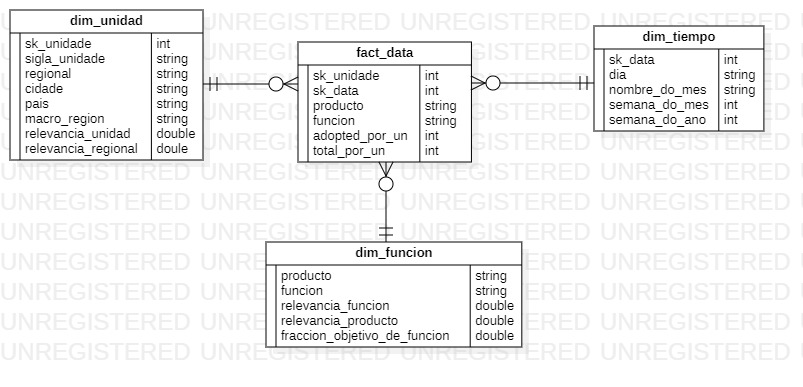

# 1. Descripciones Tablas de Salida

## 1.1. dim_unidad_de_negocio

Esta tabla contendrá información acerca de las distintas unidades de negocio, como la región y macroregión a las que la unidad de negocio pertence, la relevancia asignada a la unindad, el país y la ciudad donde esta se encuentra.

La estructura de la tabla es la siguiente:

|**Nombre Columna**|**Tipo de Dato**|**Descripción**|**Notas**|
|--|--|--|--|
|sk_unidade|Integer|Identificador único para cada unidad de negocio||
|sigla_unidade|String|Siglas representativas de la unidad de negocio||
|regional|String|Identificador de la región donde se encuentra la unidad de negocio|
|cidade|String|Nombre de la ciudad donde la Unidad de Negocio se encuentra||
|pais|String|Nombre del país donde la Unidad de Negocio se encuentra||
|macro_region|String|Nombre de la macro región a la que pertenece la Unidad de Negocio||
|relevancia_unidad|Double|Porcentaje de relevancia que tendrá la Unidad de Negocio dentro del cálculo del BMI|En total todas las relevancias asignadas deben sumar a 1, tales relevancias son definidas en las tablas Input para el Dataflow de **Unidades**|
|relevancia_regional|Double|Porcentaje de relevancia que tendrá la región donde se encuentra la Unidad de Negocio|En total todas las relevancias asignadas deben sumar a 1, tales relevancias son definidas en las tablas Input para el Dataflow de **Unidades**|

## 1.2. dim_tiempo

Actualmente toda la información de la tabla **dim_tiempo** proviene de una tabla corporativa general de tipo calendario.

|**Nombre Columna**|**Tipo de Dato**|**Descripción**|**Notas**|
|--|--|--|--|
|sk_data|Integer|Identificar único para para fila de tiempo dentro de la tabla||
|dia|String|Nombre del día cuando se registró el evento||
|nombre_do_mes|String|Nombre del mes cuando se registró el evento||
|semana_do_mes|Integer|Número de semana dentro del mes de cuando se registró el evento||
|semana_do_ano|Integer|Número de semana dentro del año de cuando se registró el evento||

## 1.3. dim_funcion

A fecha de hoy la información de la tabla **dim_funcion** es manualmente registrada y es usada para proveer contexto de la función que se quiere analizar sobre un producto, asignando una relevancia a cada función y a cada producto.

|**Nombre Columna**|**Tipo de Dato**|**Descripción**|**Notas**|
|--|--|--|--|
|producto|String|Nombre del producto|Sirve al mismo tiempo como un identificador único de cada producto para poder realizar relaciones con otras tablas|
|funcion|String|Nombre de la función que se quiere analizar del producto|En conjunto con la columna **producto** sirve como identificador único de cada fila dentro de la tabla
|relevancia_funcion|Double|Relevancia asignada a una funcion para cada producto||
|relevancia_producto|Double|Relevancia asignada al producto||
|fraccion_objetivo_de_funcion|Double|El objetivo de crecimiento al que la función apunta||

## 1.4. fact_data

Esta tabla es donde se almacenarán los datos para el análisis. Cada fila es una tupla única identificada por una unidad de negocio, un momento en el tiempo, un producto y una función de tal producto. Las demás tablas descritas hasta el momento brindan un contexto a tal información.

|**Nombre Columna**|**Tipo de Dato**|**Descripción**|**Notas**|
|--|--|--|--|
|sk_unidade|Integer|Identificador de la Unidad de Negocio, es usado para establecer relación con la tabla **dim_producto**||
|sk_data|Integer|Identificador del instante del evento, usado para establecer relación con la tabla **dim_tiempo**||
|producto|String|Nombre del producto sobre el que se está analizando una función|Esta columna también es usada para establecer la relación con ta tabla **dim_producto**|
|funcion|String|Funcion que se esta analizando de un producto sobre una unidad de negocio|Esta columna también sirve como un identificador pese a que no es utilizada para establecer una relación con alguna tabla|
|adopted_per_un|Integer|Porcentaje de adopción de la función de un producto sobre una unidad de negocio||
|total_per_un|Integer|Objetivo de adopción|Debe ser presentado en forma de cantidad total|

# 2. Diagrama del modelo ER para el Data Warehouse

# 3. Información necesaria para alimentar el Data Warehouse

